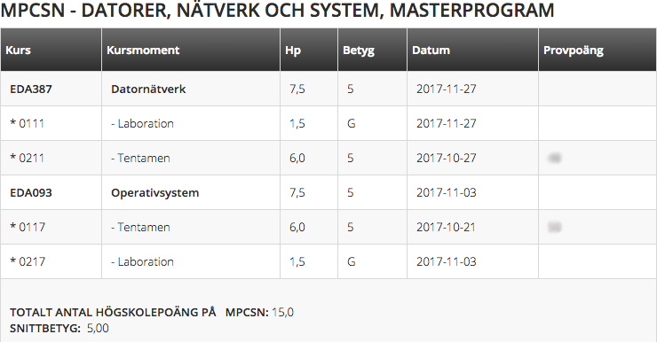

# ChalmersGPA
Chrome plugin intended to automatically calculate the GPA for an authenticated user at Chalmers Student Portal.

## How it looks

Your GPA will be printed below the total number of credits.

## Installation
Simply unzip ``plugin.zip`` and load it into Chrome from the "Add-ons" section in the browser. Then log into the student portal and visit [this page](https://student.portal.chalmers.se/sv/chalmersstudier/minaresultatochintyg/Sidor/Resultatforteckning.aspx) to check your GPA!

## TODO
* Should be "officially" released in the Chrome Web Store.
